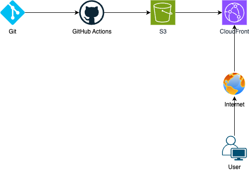

# hhplus-5th-team10

## GitHub Actions 워크플로우 과정
: .github/workflows/deployment.yml 파일에 의해 실행됩니다.  

- main 브랜치에 push 되는 경우 배포가 진행되며 이때 steps 에 명시한 단계를 따라 진행됩니다. 각 step의 name은 자유롭게 작성할 수 있으며 github에서 각 단계를 보여주는 이름이 되기 때문에 어떤 작업에 대한 step인지 알아볼 수 있게 합니다.




### steps
1. Checkout repository:  Checkout 액션을 사용해 코드 내려받기
2. Install dependencies: 프로젝트 의존성 설치
3. Build: 명령어로 Next.js 프로젝트 빌드
4. Configure AWS credentials: AWS 자격 증명 구성
5. Deploy to S3: 빌드된 파일을 S3 버킷에 동기화
6. Invalidate CloudFront cache: CloudFront 캐시 무효화

이때 4번 과정은 과제 문서와는 조금 다르게 진행하였는데, 과제 문서에서는 aws-access-key-id와 aws-secret-access-key를 가지고 AWS credentials를 구성하였으나, AWS 공식문서의 best practice를 따라 key를 노출시키는 것보다는 role arn으로 구성하였습니다. 이렇게 arn 으로 구성할 경우 혹시 값이 노출되더라도 aws에 직접 접근하기는 어렵기 때문에 보안상 좀 더 안전한 방법이라고 생각됩니다. 

S3에 배포한 이후에는 CloudFront 캐시를 무효화 하는 과정이 필요합니다. S3에는 새로운 파일이 배포되었지만 CloudFront에서 기존 캐시된 콘텐츠를 계속 제공할 수 있기 때문입니다. 캐시 무효화를 하지 않으면 캐시 만료 시간(TTL)까지 기다려야 합니다. 


## 주요 링크
- S3 버킷 웹사이트 엔드포인트: http://hhplus-5th-team10-yoojin.s3-website.ap-northeast-2.amazonaws.com
- CloudFrount 배포 도메인 이름: https://d2vhs2nv5zcqaw.cloudfront.net


### S3 배포와 CloundFront 배포의 차이점 
위 두 링크로 배포된 같은 서비스에 접근했을 때 브라우저에서 받아오는 응답 파일들의 크기가 다르고, 이에 따라 다운로드 속도가 차이가 나는 것을 확인할 수 있었습니다. 

- root 경로 document 파일 크기 / 다운로드 시간
S3: 11.2Kb / 115ms
CloundFront : 3.0Kb / 78ms

CloudFront에서 받은 문서의 response header를 보면 
``` x-cache: Hit from cloudfront ``` 
가 포함되어 있는데 이는 cloudfront 캐시에서 응답되었다는 것을 의미합니다. 

Cloudfront에서 제공하는 컨텐츠는 압축된 파일을, 가장 가까운 엣지 로케이션에서 콘텐츠를 제공하기 때문에 결과적으로 훨씬 빠른 응답 시간을 제공할 수 있습니다. 
